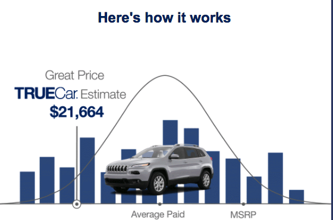

***General instructions for all assignments***: 

+  Use this file as the template for your submission.  Delete the unnecessary text (e.g. this text, the problem statements, etc).  That said, keep the nicely formatted "Problem 1", "Problem 2", "a.", "b.", etc
+  Upload a single `R` Markdown file (named as:  [AndrewID]-Lab04.Rmd -- e.g. "sventura-Lab04.Rmd") to the Lab 02 submission section on Blackboard.  You do not need to upload the .html file.
+  The instructor and TAs will run your .Rmd file on their computer.  **If your .Rmd file does not knit on our computers, you will be automatically be deducted 10 points.**
+  Your file should contain the code to answer each question in its own code block.  Your code should produce plots/output that will be automatically embedded in the output (.html) file
+  Each answer must be supported by written statements (unless otherwise specified)
+  Include the name of anyone you collaborated with at the top of the assignment
+  Include the style guide you used at the top of the assignment


In this week's assignments, we'll finish our discussion of strictly categorical data and move on to continuous data.


***
***


#  Oral Evaluation Graphic

**Note:  You have to look at the HTML file on Blackboard to see the oral evaluation graphic**

Here is this week's oral evaluation graphic:

<div style="width:750px">

</div>


**Sam Says**:  It's important to avoid inserting your own commentary when discussing graphics  Your job, as a statistician / data scientist / quantitative analyst, is to interpret the graph for the viewer.  Discuss the facts presented via the data/graphic; avoid overstepping your boundaries by inserting your own opinions into what should be a presentation of facts.

Reminder, the following strategy is ideal when presenting graphs orally:

+  First, explain what is being shown in the graph.  What is being plotted on each axis?  What do the colors correspond to?  What are the units (if applicable)?  What are the ranges of different variables (if applicable)?  Where does the data come from (if applicable)?

+  Next, explain the main takeaway of the graph.  What do you want the viewer to understand after having seen this graph?

+  If applicable, explain any secondary takeaways or other interesting findings.

+  Finally, for this class, but not necessarily in general:  Critique the graph.  What do you like/dislike?  What would you keep/change?  Etc.


***
***


***
***

#  Problem 1

(5 points each)

**Chi-Square Tests for Independence in `R`**:  

In this assignment, we'll again use data from the NYC Citi Bike program, available on the course GitHub page.  Additional information about the NYC Citi Bike data can be found [here](https://www.citibikenyc.com/system-data).

Read the dataset in from GitHub and add the same variables from last week (code provided).  Then complete the following questions.

```{r, warning = F, message = F}
library(tidyverse)
library(reshape2)

#  Read in data
bike_data <- read_csv("https://raw.githubusercontent.com/sventura/315-code-and-datasets/master/data/nyc-citi-bike-data-subset.csv")
date_time <- colsplit(bike_data$starttime, " ", c("date", "time"))

#  Add start_date variable to big_bike, and a bunch of other variables
bike_data <- mutate(bike_data,
                    time_of_day = as.vector(date_time$time),
                    start_date = as.Date(date_time$date, format = "%m/%d/%Y"),
                    birth_decade = paste0(substr(`birth year`, 1, 3), "0s"),
                    hour_of_day = as.integer(substr(time_of_day, 1, 2)),
                    am_or_pm = ifelse(hour_of_day < 12, "AM", "PM"),
                    day_of_week = weekdays(start_date),
                    less_than_30_mins = ifelse(tripduration < 1800, 
                                               "Short Trip", "Long Trip"),
                    weekend = ifelse(day_of_week %in% c("Saturday", "Sunday"), 
                                     "Weekend", "Weekday"))
```

a.  Create a contingency table of the `gender` and `am_or_pm` variables using the `table()` function, and store this in an object called `tab1a`.  Then, test to see if these two variables are independent using a chi-square test with the following code:  `chisq.test(tab1a)`.  

+  What information is returned from the chi-square test?  
+  What is the chi-square test statistic?
+  What is the p-value of the test? 
+  What is your conclusion -- is there enough evidence to reject the null hypothesis that the two variables independent?

b.  Repeat part (a), but this time, re-order the variables in the table function.  Do the test results change?  Does this make sense?  Why or why not?

c.  Repeat part (a), but this time, test the independence of the `day_of_week` and `am_or_pm` variables.  This time, interpret the result of the chi-square test for independence **in the context of the problem**.  Do you think your result makes sense in the context of the problem?

d.  Repeat part (c), but this time, test the independence of the `am_or_pm` and `less_than_30_mins` variables.  Be sure to interpret the result **in the context of the problem**.  Do you think your result makes sense, given what we might expect about bike riders in NYC?


***
***


#  Problem 2

**Mosaic Plots**

There is no official, `ggplot()`-sanctioned code for creating mosaic plots in `ggplot()`, so we wrote our own.  That is, we created a new **geometry** specifically for mosaic plots, called `geom_mosaic()`.  (Huge thanks to Statistics PhD student Peter Elliott for making this possible!)  

In order to use `geom_mosaic()`, you need to download it from the course GitHub page.  To do this, first **install the `devtools` package.**  

Then, use the following code to source the `geom_mosaic()` function code directly from the course GitHub page:

```{r, warning = F, message = F}
source("https://raw.githubusercontent.com/sventura/315-code-and-datasets/master/code/geom_mosaic.R")
```

(Note that we also wrote a custom legend function to be used with `geom_mosaic()`, called `mosaic_legend()`.  This will download automatically when you run the above code.)

For each of parts (a)--(d) in Problem 1, create the corresponding mosaic plot for the two variables being tested (4 points each).  Example code is provided for the mosaic plot for part (a):

```{r, warning = F, message = F}
ggplot(bike_data, aes(x = gender, y = am_or_pm)) + 
  geom_mosaic() + mosaic_legend()
```

Remember to add a title and appropriate axis labels to the mosaic plots.  Also, note that in this implementation, the locations of the x- and y-axis tick marks do not necessarily line up with the locations of the boxes.


***
***


#  Problem 3

**Interpretting Mosaic Plots**

Recall that mosaic plots color each box according to the standardized Pearson residuals.  If any of the residuals are greater than 2 or less than -2, we can conclude that there is enough evidence to reject the null hypothesis of independence.  

As such, when interpretting a mosaic plot:

+  If all of the cells in the mosaic plot are white, there is not enough evidence to reject the null hypothesis that the two variables are indepenedent
+  **If any of the cells in the mosaic plot are red or blue, there is evidence to reject the null hypothesis that the two variables are independent.**
+  Red cells indicate statistically significant negative deviations from what would be expected under independence
+  Blue cells indicate statistically significant positive deviations from what would be expected under independence
+  The darker the color, the larger the deviation


With this in mind, answer the following questions:

a.  (5 points)  Do the mosaic plots in Problem 2 yield the same conclusions as the chi-square tests from Problem 1 (about whether the two variables being plotted in each mosaic plot are independent)?

b.  (5 points)  What do the widths of the bars in the mosaic plot for Problem 1 part (c) correspond to?

c.  (5 points)  What do the heights of the bars in the mosaic plot for Problem 1 part (d) correspond to?

d.  (5 points)  For the mosaic plot for Problem 1 part (b), which cells (or combinations of categories) have observed counts that are significantly higher than what we would expect under independence (if any)?  Which have observed counts that are significantly lower than what would be expected under independence (if any)?


***
***


#  Problem 4

**Introduction to Continuous Data -- Histograms**

In this problem, we'll introduce continuous data using the `cars` dataset.  

a.  (4 points)  Read the help file for the `cars` dataset.  What is the description of the `cars` dataset?  What variables are included in the `cars` dataset?

```{r}
library(datasets)
data(cars)
#?cars
```

The `cars` dataset contains only continuous variables.  Let's visualize the marginal distributions of these continuous variables.  First, we'll use histograms.  Histograms divide the range of a continuous variable into (usually equal-sized) bins, then count how many observations fall into each one of these bins.  The resulting counts in each bin are displayed in a similar fashion to bar charts.

b.  (10 points)  Create a histogram showing the marginal distribution of the `speed` variable.  Remember, `ggplot()` is flexible:  the way you create a histogram is very similar to how we would create a bar chart with categorical data.  Just add `geom_histogram()` where you would normally have `geom_bar()`.  Be sure that your axes are properly labeled, that your graph has an appropriate title (e.g. "Histogram of Speed in [units]" or "Distribution of Car Speed (units)").  Be sure to specify the units where appropriate (e.g. title, labels, legend, etc).  Look at the help file for the `cars` dataset to find information on the units.

c.  (10 points)  Create another histogram of the speed variable, but this time, add the following to your code:  `geom_histogram(breaks = seq(0, 30, by = 3), col = "red", fill = "green", alpha = .2)`.

+  What did this change about the graph (aside from the coloring)?
+  Try a few new values of the `alpha` parameter.  What are the possible values you can use for `alpha`?  What happens when you decrease `alpha`?  What happens when you increase `alpha`?  What is the default for `alpha` (i.e. if you do not specify it in your code)?
+  Type `seq(0, 30, by = 3)` into the command line.  What does the `seq()` function do?
    
d.  (10 points)  Create another histogram of the speed variable, but this time, add the following to your code:  `geom_histogram(binwidth = 3)`.  Try a few different values for the `binwidth`.  What does this parameter do?

e.  (10 points)  Create another histogram of the speed variable, but this time, add the following to your code:  `geom_histogram(breaks = c(0, 5, 14, 16, 19, 20, 24, 25), col="red", fill="green")`.  Do your best to describe the distribution of the `speed` variable using this graph.  (Note:  Here, we changed the width of the bins in the histogram.  This makes the graph very confusing for the viewer because of the design variation.  I do not recommend doing this in practice.  That said, it's important that you know that it's possible to do so.)


***
***
